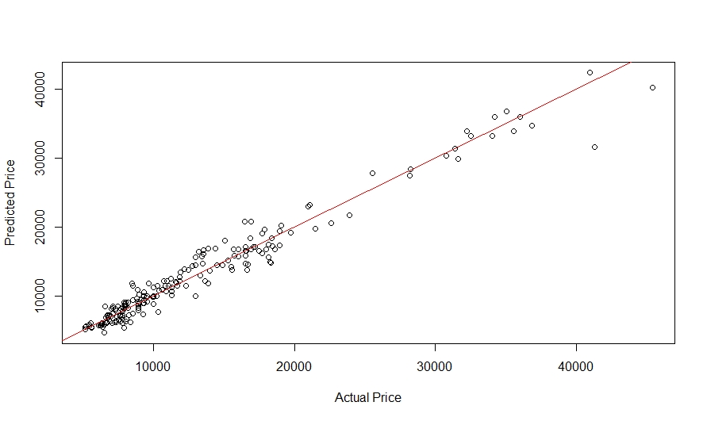
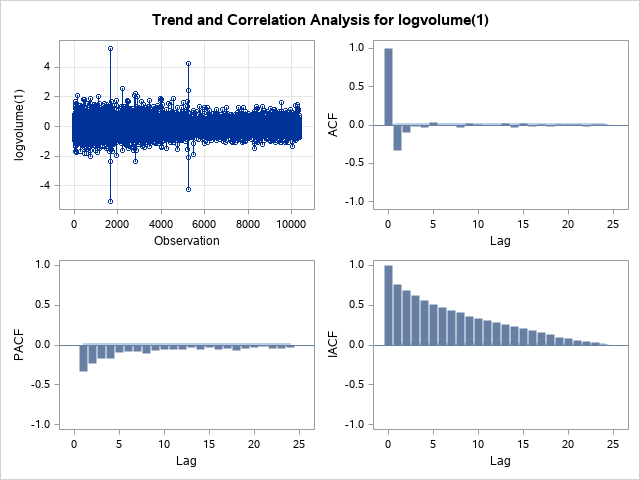
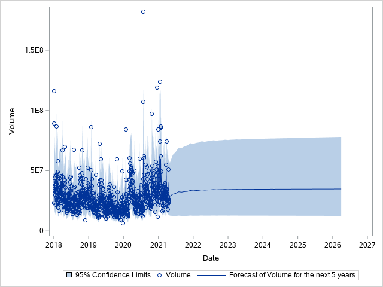

## [Project 1: Building a car price prediction model with 91% accuracy using Multiple Linear Regression](https://github.com/Conner-cloud/Conner_Projects/tree/main/Car_price_prediction)
### Summary
* Created an R program that builds a prediction model based on car specifications such as: Brand, Body type, number of cylinders and more with 91% accuracy.
* Saves money and time for car retailers, being able to predict a car's value based on specifications before purchasing to then sell for a profit.
* Cleans the data to ensure it is easy to read and work with.
* Removes insignificant variables from the model using Backwards Elimination, allowing us to specify what variables have the largest impact on a cars value.
* Visualises the density of car prices and models and distribution of car models, as well as the accuracy of the model obtained.
* Visualisation of residuals to ensure we obtain a very accurate model.

 

### [Details](https://conner-cloud.github.io/Car_price_prediction/)
### [Code](https://github.com/Conner-cloud/Conner_Projects/blob/main/Car_price_prediction/Code/Cars.R)

## [Project 2: Forecasting Intel stocks volume for the next 5 years using ARIMA](https://github.com/Conner-cloud/Conner_Projects/tree/main/Intel_forecast_project)
### Summary
* Created a SAS program that produces and ARIMA model to forecast the volume of stock from Intel.
* Saves money for investors looking to purchase stocks. Also helps save the company money on storage of volume as they can predict how much space is needed.
* Data is cleaned and easily readable.
* Residuals, ACF, PACF is used to help in selecting the best model.
* Visualisation of the forecast along with the rest of the data.
* 95% Confidence Intervals are also plotted.
* Outliers are identified and resolved to increase model accuracy.
* Large dataset used for the best accuracy.

 

### [Details](https://conner-cloud.github.io/Intel_stock_forecast/)
### [Code](https://github.com/Conner-cloud/Conner_Projects/blob/main/Intel_forecast_project/Code/Intel_stocks.sas)

## [Project 3: Querying Covid data in SQL and visualization in Tableau](https://github.com/Conner-cloud/Conner_Projects/blob/main/Covid_Visualization/Code/Covid_Portfolio.sql)
### Summary
* Created a SQL query to create/select data and put it into data to be used in Tableau
* Look at how each country was affected by covid from March 2020 to now.
* Created beautiful visualization in Tableau such as a heat map, bar chart, line graph (with a forecast) and tables.
* Obtained the chance of death from all of the worlds covid data,

 

