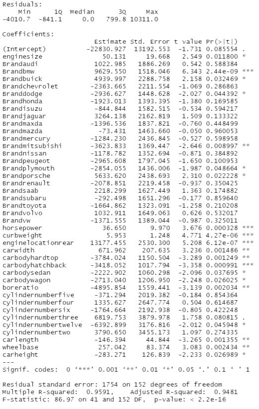
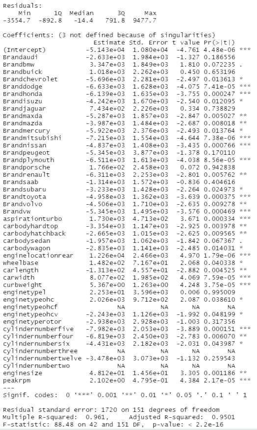
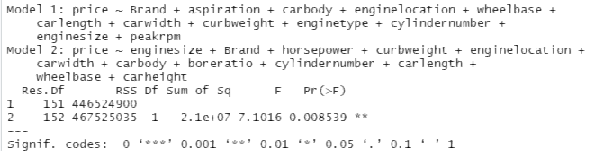

# Portfolio of Projects
This portfolio contains a few projects I have been working on since I graduated with a Bachelor's in Mathematics. I use a variety of programming languages to visualise, predict, classify and forecast a variety of datasets. Feel free to contact me if you have any questions regarding any of the projects.

## [Project 1: Building a car price prediction model using Multiple Linear Regression](https://github.com/Conner-cloud/Conner_Projects/tree/main/Car_price_prediction)
* Created an R program that builds a prediction model based on car specifications such as: Brand, Body type, number of cylinders and more with 91% accuracy.
* Cleans the data to ensure it is easy to read and work with.
* Removes insignificant variables from the model using Backwards Elimination, allowing us to specify what variables have the largest impact on a cars value.
* Visualises the density of car prices and models and distribution of car models, as well as the accuracy of the model obtained.
* Visualisation of residuals to ensure we obtain a very accurate model.

### Visualising and Cleaning the Data
After cleaning the data so that all car models were listed under the name of the brand (e.g. Volkwagen Golf 2007 -> VW) I plotted the distribution of car models. The bar chart shows cleanly which car brand has the most number of models (Toyota) and which has the least (Mercury). We can see that most car brands have around 10 models but this plot is not a good visualisation of averages.

Here I plot the density of car models, we can see the average number of car models between all brands more clearly. There is also a small peak at 32 models which we know to be Toyota from the bar chart above. The average number of models per car brand is approximately ~ 5 models.

Since we are interested in the price of the car we should plot the density of car prices to get an understanding of the average price of a car. We can see most cars are £10000, the curve drops and then flattens around £20000 where a few more cars sit, the curve then flattens towards £50000 as we expect.

### Building a model
Firstly, I started with a model that includes all variables. This way I can plot all residuals to detect outliers and more importantly determine if the data is suitable for multiple linear regression.

* Residuals VS Fitted: The red line is horizontal suggesting linearity and there are an equal number of residuals above and below the line suggesting zero-mean.
* Normal Q-Q plot: Majority of the residuals are on  or close to the diagonal line suggesting normality.
* Scale-Location: Mostly horizontal line suggesting the assumption of contant variance is upheld by our model.
* Residual VS leverage: We can identify one outlier in the bottom right.

Overall it appears our model is a good fit and suitable for prediction using Multiple Linear Regression. However, we need to deal with the outlier identified and we can also make our model simpler without reducing the accuracy of the model. Using Backward Elimination or Forward Selection we can remove insignificant variables from the model and build a simpler one to use for prediction.

### Forward model

### Backward model

### Comparing models
Comparing the two models, the backward model appears to have more significant variables as well as having a higher R-squared value, suggesting it is the better model. The F-test below shows that the F-statistic is significant. Hence we have evidence to reject the null hypothesis that the models are not significantly different. We have enough evidence to say that the backward model is a better predictor than the forward model.

Now lets compare the backward model to the original model we started with to make sure that performing a backward elimination hasn't made the model worse for prediction.

